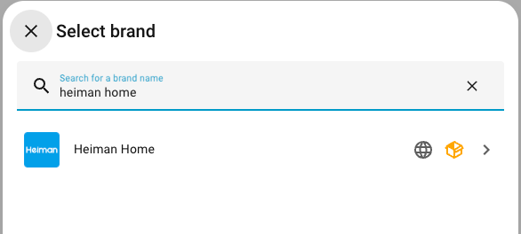
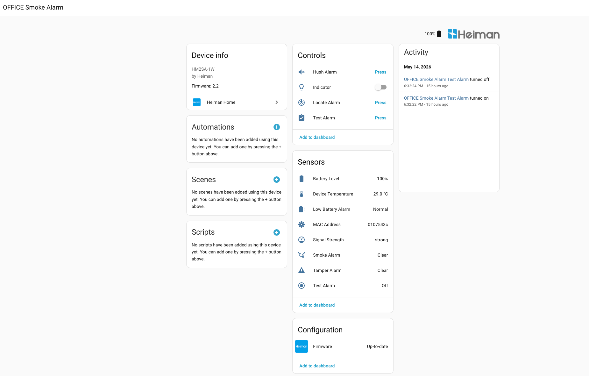
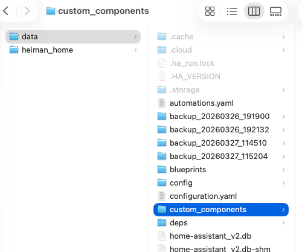

# Heiman Home For HomeAssistant


---

<p align="center">
  
</p>


## Overview (English) / Überblick (Deutsch)

This repository contains the Home Assistant integration for Heiman smart home devices. This repository is available in multiple languages to help users worldwide understand and use the integration easily.

Dieses Repository enthält die Home Assistant-Integration für Heiman Smart-Home-Geräte. Dieses Repository ist in mehreren Sprachen verfügbar, damit Nutzer weltweit die Integration einfach verstehen und nutzen können.

### Available Languages / Verfügbare Sprachen:

- [English (en)](readme/README_en.md)
- [German (deutsch) (de)](readme/README_de.md)
- [Dutch (nederlands) (nl)](readme/README_nl.md)
- [Spanish (español) (es)](readme/README_es.md)
- [French (français) (fr)](readme/README_fr.md)
- [Italian (italiano) (it)](readme/README_it.md)
- [Portuguese (português) (pt)](readme/README_pt.md)
- [Russian (русский) (ru)](readme/README_ru.md)
- [Simplified Chinese (中文) (cn)](readme/README_cn.md)
- [Japanese (日本語) (ja)](readme/README_ja.md)
- [Arabic (العربية) (ar)](readme/README_ar.md)
- [Greek (Ελληνικά) (el)](readme/README_el.md)
- [Hindi (हिन्दी) (hi)](readme/README_hi.md)
- [Polish (polski) (pl)](readme/README_pl.md)
- [Turkish (türkçe) (tr)](readme/README_tr.md)

If a language is missing, please let us know, and we will do our best to add it.

Falls eine Sprache fehlt, lassen Sie es uns wissen, und wir bemühen uns, diese hinzuzufügen.

## Features

- 🔌 **Multi-device Support**: Gateways, sensors, switches, alarms, and more
- ☁️ **Cloud Integration**: Connect via Heiman account with OAuth2 authentication
- 📡 **MQTT Real-time Updates**: Instant device status updates via MQTT push
- 🔄 **Firmware Management**: Check and install firmware updates directly from Home Assistant
- 👨‍👩‍👧‍👦 **Child Device Management**: Add, remove, and manage gateway sub-devices via MQTT
- 🏠 **Multi-home Support**: Manage multiple Heiman homes independently
- 🎛️ **Comprehensive Entities**: Sensors, switches, buttons, selects, binary sensors, and update entities
- ⚙️ **Web UI Configuration**: Easy setup without YAML configuration

<a name="installation"></a>
## Installation

### Method 1: HACS (Recommended)

#### First Installation
1. Open **HACS** → **Integrations**
2. Click **+ EXPLORE & DOWNLOAD REPOSITORIES**
3. Search for `Heiman Home` or click the three dots (⋮) → **Custom repositories**
4. Add repository: `https://github.com/hass-user/heiman-home` with category `Integration`
5. Click **DOWNLOAD THIS REPOSITORY**

#### Update Component
1. Open **HACS** → **Integrations**


2. Find **Heiman Home**



3. Click ****UPDATE** or **Redownload****



### Method 2: Manual Installation via Samba/SFTP

1. Download the latest release from [GitHub Releases](https://github.com/hass-user/heiman-home/releases)
2. Extract the `heiman_home` folder
3. Copy the `heiman_home` folder to your Home Assistant `custom_components` directory
   ```
   /config/custom_components/heiman_home/
   ```
   



### Method 3: One-key Shell via SSH/Terminal & SSH Add-on

```shell
wget -O - https://raw.githubusercontent.com/hass-user/heiman-home/main/install.sh | bash -
```

### After Installation

1. Restart Home Assistant
2. Go to **Settings** → **Devices & Services**
3. Click **+ Add Integration**
4. Search for `Heiman Home`

<a name="configuration"></a>
## Configuration

### Add Integration via Web UI

1. Open Home Assistant web UI
2. Navigate to **Settings** → **Devices & Services**
3. Click **Add Integration**
4. Search for `Heiman Home` and select it
5. Authorize with your Heiman account (OAuth2)
6. Select the home you want to integrate
7. Complete the setup

### Authentication

The integration uses OAuth2 for secure authentication:
- Click **Authorize** to log in to your Heiman account
- Grant necessary permissions
- Select the home you want to integrate

### Multiple Homes

You can add multiple Heiman homes:
1. Each home creates a separate configuration entry
2. Each home has independent device management
3. Configure each home separately in **Devices & Services**

### Device Filtering

You can filter which devices to integrate:
1. Open the integration settings
2. Navigate to **Options**
3. Enable/disable specific devices
4. Save changes

<a name="supported-devices"></a>
## Supported Devices

### Gateways
-  Smart Gateway (WS3GW-R, etc.)
- 🌐 Zigbee Gateway
- 🌐 WiFi Gateway

### Sensors
- 🌡️ Temperature & Humidity Sensors
- 🚪 Door/Window Sensors
- 💧 Water Leak Sensors
- 🔥 Smoke Sensors
- 💨 Gas Sensors
- 🏃 Motion Sensors
- 🌞 Illumination Sensors

### Alarms & Security
- 🚨 Alarm Systems
- 🔔 Alarm Sound Control
- 🚪 Access Control

### Switches & Controls
- 🔌 Smart Plugs
- 💡 Light Switches
- 🎛️ Scene Controllers

### Other Devices
- ️ Thermostats
- 💨 Air Quality Monitors
- 🔋 Battery-powered Devices

<a name="entities"></a>
## Entity Types

### Sensor Entities
- Temperature
- Humidity
- Battery Level
- Signal Strength (RSSI)
- Illumination
- Device Status

### Binary Sensor Entities
- Door/Window Open/Closed
- Motion Detected
- Water Leak
- Smoke Detected
- Tamper Status
- Low Battery Warning

### Switch Entities
- Device On/Off
- Indicator Light
- Buzzer Control
- Alarm Enable/Disable

### Button Entities
- Refresh Device Status
- Remote Check
- Remote Locate
- Remote Silence

### Select Entities
- Alarm Sound Options (Fast Beep, Medium Beep, Slow Beep)
- Temperature Unit (°C / °F)
- Operating Mode
- Signal Level Display

### Number Entities
- Temperature High Threshold
- Temperature Low Threshold
- Humidity High Threshold
- Humidity Low Threshold
- Temperature Comfort Range
- Humidity Comfort Range

### Update Entities
- Firmware Version
- Available Updates
- Firmware Installation Progress

<a name="firmware-management"></a>
## Firmware Management

### Check for Updates
- Firmware updates are automatically checked during device synchronization
- Update entities show available firmware versions
- Compare installed version with latest available version

### Install Firmware Updates
1. Navigate to the device in Home Assistant
2. Open the **Firmware** entity
3. Click **Install** button
4. Monitor update progress in real-time
5. Device will restart after update completion

### Update Features
- ✅ Automatic version detection
- ✅ Progress monitoring (0-100%)
- ✅ Update status tracking
- ✅ Version comparison
- ✅ Batch update checking

<a name="mqtt-integration"></a>
## MQTT Integration

### Real-time Updates
The integration uses MQTT for instant device status updates:
- No polling delay
- Instant state changes
- Lower API usage
- Better performance

### MQTT Configuration
- Automatically configured during setup
- Uses Heiman MQTT broker
- Secure connection with TLS/SSL
- No manual configuration required

### Supported MQTT Features
- Device property updates
- Online/offline status
- Alarm events
- Sensor readings
- Child device management (registration, unregistration, discovery)

<a name="child-device-management"></a>
## Child Device Management

The integration provides comprehensive child device management through the `heiman-connect` library. 
All device management logic is implemented in the SDK, and Home Assistant integration provides a simple API to access these features.

### Using Child Device Manager

```python
from heimanconnect import ChildDeviceManager

# Get child device manager from API client
device_manager = await api_client.async_get_child_device_manager(
    user_id="your_user_id",
    devices=devices_dict,
    user_display_name="Your Name"
)

# Add a child device (recommended method)
result = await device_manager.add_and_sync_device(
    gateway_product_id="1733421468953686016",
    gateway_device_id="1760910156165971969",
    child_device_id="1768080341172985856",
    child_product_id="1734821218500292608",
    child_device_name="Door Sensor"
)

# Remove a child device (recommended method)
result = await device_manager.remove_and_sync_device(
    gateway_product_id="1733421468953686016",
    gateway_device_id="1760910156165971969",
    child_device_id="1768080341172985856",
    product_id="1734821218500292608",
    device_name="01000053"
)
```

### Available Methods

For detailed documentation on all available methods and their parameters, see the [heiman-connect library documentation](https://pypi.org/project/heiman-connect/).

<a name="advanced-configuration"></a>
## Advanced Configuration

### Logger Configuration

Enable debug logging for troubleshooting:

```yaml
# configuration.yaml
logger:
  default: warning
  logs:
    custom_components.heiman_home: debug
    heimanconnect: debug
```

### Customizing Entities

```yaml
# configuration.yaml
homeassistant:
  customize: !include customize.yaml

# customize.yaml
sensor.heiman_temperature:
  friendly_name: "Living Room Temperature"
  device_class: temperature
  unit_of_measurement: "°C"

binary_sensor.heiman_door:
  friendly_name: "Front Door"
  device_class: door
```

### Exclude Attributes

```yaml
# configuration.yaml
heiman_home:
  exclude_attributes:
    - raw_data
    - firmware_info
    - configuration
```

<a name="services"></a>
## Services

### `heiman_home.refresh_device`

Manually refresh a device's status.

```yaml
service: heiman_home.refresh_device
data:
  device_id: "1972646416676724736"
```

### `heiman_home.refresh_all_devices`

Refresh all devices in the integration.

```yaml
service: heiman_home.refresh_all_devices
```

<a name="debugging"></a>
## Debugging

### Get Entity State Attributes

1. Open **Developer Tools** → **States**
2. Search for your entity (e.g., `sensor.heiman_temperature`)
3. View all attributes and current state

### Get Debug Logs

1. Enable debug logging (see [Logger Configuration](#advanced-configuration))
2. Open **Settings** → **System** → **Logs**
3. Search for `heiman_home` or `heimanconnect`

### Common Issues

#### Device Not Showing
- Check device filtering settings
- Verify device is online in Heiman app
- Restart the integration

#### Firmware Update Not Working
- Ensure device is online
- Check device compatibility
- Verify firmware update is available in Heiman app

#### Connection Issues
- Check internet connectivity
- Verify Heiman account credentials
- Check Home Assistant logs for errors

#### MQTT Not Connecting
- Verify network allows outbound connections to `spmqtt.heiman.cn:1884`
- Check firewall settings
- Restart Home Assistant

<a name="troubleshooting"></a>
## Troubleshooting

### Authentication Failed
1. Re-authorize the integration
2. Verify Heiman account credentials
3. Check if account has access to the selected home

### Devices Not Updating
1. Check MQTT connection status in logs
2. Verify device is online
3. Try manual refresh via service

### High Database Usage
- Exclude unnecessary attributes (see [Exclude Attributes](#advanced-configuration))
- Disable unused entities
- Check for entities with too many state changes

### Performance Issues
- Reduce update interval if possible
- Filter out unused devices
- Disable MQTT if not needed (not recommended)

<a name="development"></a>
## Development

### Project Structure
```
heiman_home/
├── __init__.py          # Integration initialization
├── api.py               # API client wrapper
├── config_flow.py       # Configuration flow
├── const.py             # Constants and configuration
├── coordinator.py       # Data update coordinator
├── sensor.py            # Sensor platform
├── binary_sensor.py     # Binary sensor platform
├── switch.py            # Switch platform
├── button.py            # Button platform
├── select.py            # Select platform
├── number.py            # Number platform
├── update.py            # Update platform (firmware)
├── manifest.json        # Integration metadata
└── strings.json         # Translations
```

**Note**: All device management logic is in the `heiman-connect` library, not in this integration.

### Dependencies
- `heiman-connect`: Python library for Heiman API
- `packaging`: Version comparison for firmware updates

<a name="contributing"></a>
## Contributing

Contributions are welcome! Please feel free to submit:
- Bug reports
- Feature requests
- Device support
- Translations
- Documentation improvements

<a name="license"></a>
## License

This project is licensed under the MIT License - see the [LICENSE](LICENSE) file for details.

<a name="acknowledgments"></a>
## Acknowledgments

- [Heiman](www.heimantech.com) for providing the IoT platform
- [Home Assistant](https://www.home-assistant.io) community
- [HACS](https://hacs.xyz) for the integration framework
- All contributors and testers

<a name="support"></a>
## Support

- **GitHub Issues**: [Report bugs or request features](https://github.com/hass-user/heiman-home/issues)
- **Home Assistant Community Forum**: [Discuss and get help](https://community.home-assistant.io/)
- **Documentation**: [Full documentation](https://github.com/hass-user/heiman-home/wiki)

---

**Enjoy your smart home with Heiman and Home Assistant! 🏠✨**
